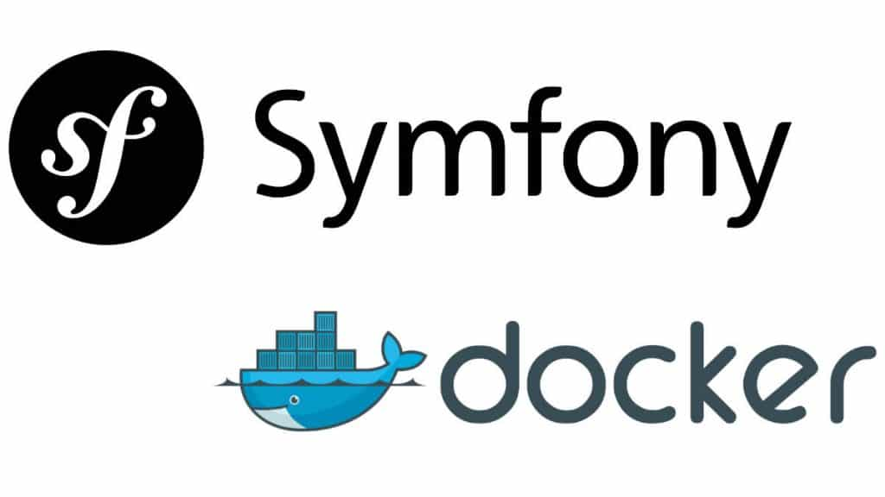

# Tuto Symfony API REST avec Docker

> [!NOTE]
> Objectif : S'entrainer à utiliser la dockerisation d'un projet Symfony afin d'être capable de concevoir une API REST pour répondre à une demande en respectant les règles de l'art.
>
> Ressources : [Doc Symfony](https://symfony.com/doc/current/setup.html)

### Outils nécessaires à installer au préalable
- GIT
- Docker

### Instruction 
- [Créer un projet API Symfony avec Docker](docs/INSTALLATION.md)
- [Installation du bundle API Platform sous Symfony](docs/API.md)
- [Configurer l’authentification JWT dans Symfony pour sécuriser l’API](docs/JWT.md)

